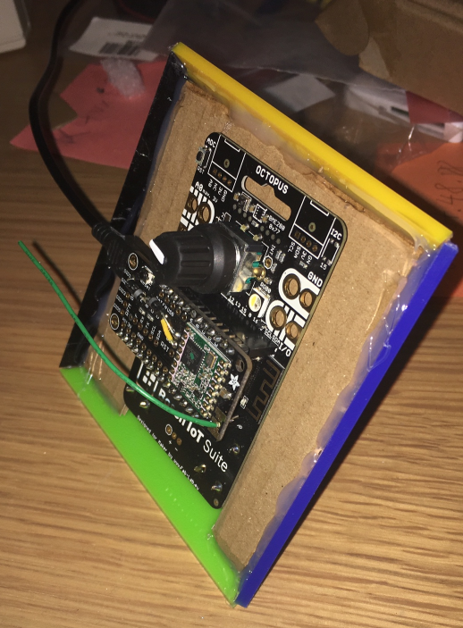
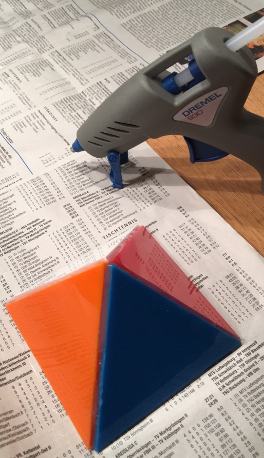

# octopus-lora-octahedron-switch
Switch having 8 states realized by hosting an 
[Octopus board](https://www.tindie.com/products/FabLab/iot-octopus-badge-for-iot-evaluation) 
inside an [octahedron](https://en.wikipedia.org/wiki/Octahedron ) object.

## Idea
The idea is to implement a remote switch by using the geometric shape of a octahedron.
The octahedron has 8 faces, so there are 8 stable switch positions. The current state of
this switch is sent using LoRaWAN and The Things Network.

Wikipedia: https://en.wikipedia.org/wiki/Octahedron

## Required libraries:
* LMIC-Arduino - Arduino port of the LMIC library
* Adafruit Unified Sensor
* Adafruit BNO055

## Application logic
* Only if the state of the switch (the orientation of the octahedron) has
actually changed, a new LoRa message is sent to The Things Network.
* The state has to remain stable for at least 10 seconds to be considered as a valid state.
* The 3D space can be split up into 8 octants. 
You can find out the current state of the switch by evaluating in which of these 8 octants the gravitation vector 
currently is located.
Wikipedia: https://en.wikipedia.org/wiki/Octant_(solid_geometry)

